# Deep Learning Nanodegree - Project 2

# Landmark Classification

This project develops a neural network for identifying landmark on social media images. The project explores 2 methodologies: building a neural network "from scratch" and building a neural network using transfer learning (VGG16).

This is the 2nd project in Udacity's Deep Learning Nanodegree [1][2]. This README acts as a final report for the project.

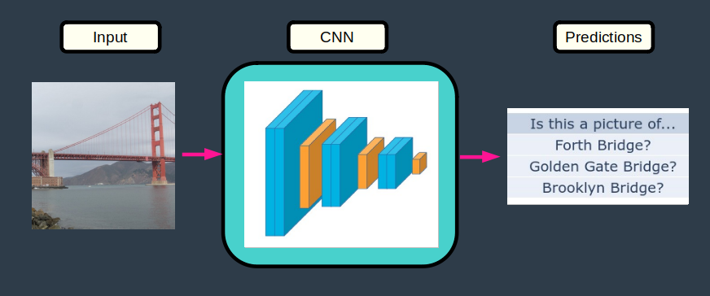


# Table of Contents

[SETUP](#setup)

&emsp;[Install](#install)<br>
&emsp;[Project Files](#project-files)

[PROBLEM](#problem)

&emsp;[Overview](#overview) <br>
&emsp;[Requirements](#requirements)

[DATA](#data)

&emsp;[Input Data](#input-data) <br>
&emsp;[Category Distributions](#category-distributions) <br>
&emsp;[Image sizes](#image-sizes)

[DESIGN](#design)

&emsp;[Pipeline](#pipeline) <br>
&emsp;[Valid Dataset](#valid-dataset) <br>
&emsp;[Data Loaders](#data-loaders) <br>
&emsp;[Data Pre-Processor](#data-pre-processor) <br>
&emsp;[CNN 1 - From Scratch](#cnn-1---from-scratch) <br>
&emsp;[CNN 2 - From Transfer Learning](#cnn-2---from-transfer-learning) <br>
&emsp;[Train](#train) <br>
&emsp;[Test](#test) <br>

[IMPLEMENTATION](#implementation)

&emsp;[landmark.py](#landmarkpy)<br>
&emsp;[Usage - Train the CNN](#usage---train-the-cnn)<br>
&emsp;[Usage - Predict With the CNN](#usage---predict-with-the-cnn)<br>

[APPENDIX](#appendix)

&emsp;[Accronyms](#accronyms) <br>
&emsp;[References](#references)


# Setup

### Install

1 - Clone this repository.

	$ cd ~
	$ git clone https://github.com/martin0004/landmark_classification.git	

2 - Install [miniconda](https://docs.conda.io/en/latest/miniconda.html). <br>

3 - Create/activate conda environment for this project.

	$ conda env create --file install/environment.yaml
	$ conda activate landmark

4 - Download the [dataset](https://udacity-dlnfd.s3-us-west-1.amazonaws.com/datasets/landmark_images.zip) for this project and extract it into directory `data/`.

### Project Files

```
data/                       Directory for training data.   
    landmark_images/        Image dataset (must be downloaded).
        test/               Testing images (must be downloaded).
        train/              Training images (must be downloaded).

dev/
    data.ipynb              Notebook for exploring data.
    design.ipynb            Notebook for developing/training neural network.
    implementation.ipynb    Notebook for developing usage code.
    
images/                     Images for the README.

landmark.py                 CNNs and supporting classes/functions.
testme.jpg                  Dummy image for testing neural network.
categories.json             Image categories (IDs & names).

```


# Problem

### Overview

Images are being uploaded to social media platforms everyday. During upload, these services can automatically tag the image with its location based on the image metadata (such as GPS coordinates).

However, when the image does not contain GPS data, an alternate method to pinpoint the location where the photo was taken is to identify a recognizable landmark in the picture. This can be performed with a CNN.


### Requirements

- Design 2 CNNs to classify an image based on a landmark in this image.
	+ 1 CNN "from scratch".
	+ 1 CNN using transfer learning.
- Select the best CNN (target accuracy > 60%).
- Create a simple interface for others to run the best CNN developed above.


# Data

### Input Data

CNNs in this project are trained using a dataset of landmark images provided by Udacity [3]. This dataset contains about 6000 images divided into 50 categories.  Image category ID/names are stored in file `categories.json`.

Note that the dataset used in this project is a subset of the Google Landmark Dataset v2 [4].

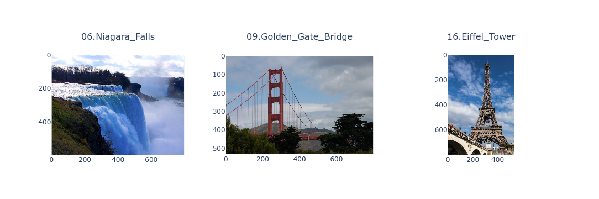 


### Train-Test Datasets

The landmark images were already split into training and testing datasets by Udacity.

| datasets   | data_points   | %_total   |
|:-----------|:--------------|:----------|
| train      | 4996          | 80        |
| test       | 1250          | 20        |
| -          | -             | -         |
| total      | 6246          | 100       |


### Category Distributions

- There are 100 images/category in the training dataset
- There are 25 images/category in the testing dataset.

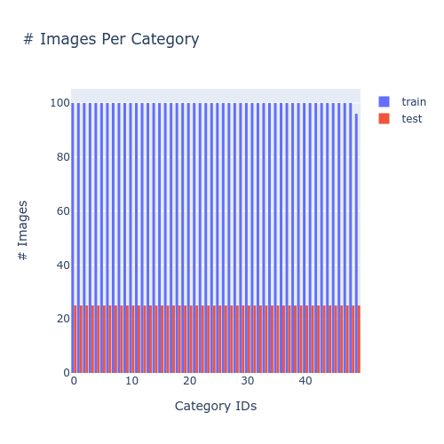

### Image Sizes

- Most images are < 200 kB.
- The largest images are 800 x 800 pixels.
- Most images have one side which is 800 pixels.

<table>
    <tr>
        <td>
            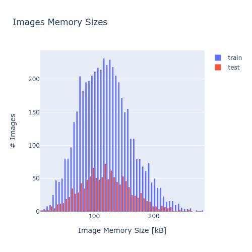
        </td>
        <td>
            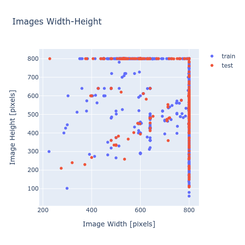
        </td>
    <tr>
</table>


# Design

### Pipeline

The neural networks developped in this project are part of the following machine learning pipeline.

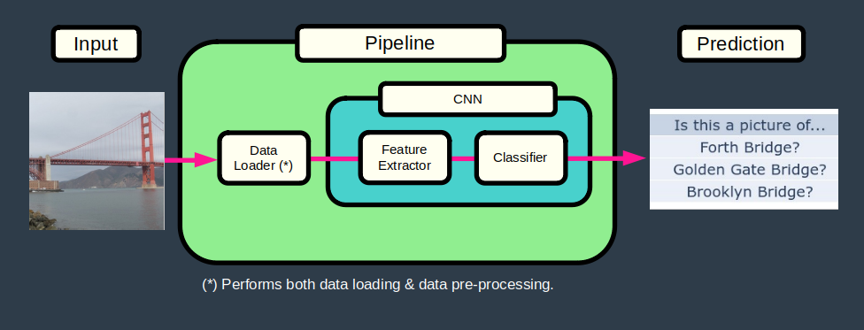

### Valid Dataset

A validation dataset was created by taking 25 % of the train dataset. This created a final train-valid-test data split of 60-20-20%.

### Data Loaders

Data loaders read an image from disk, perform pre-processing on the picture and return a tensor which can be manipulated by the neural network.

The **train dataloader** performs the following data pre-processing (which includes data augmentation).

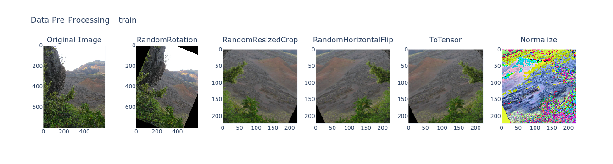 

And the **valid/test dataloaders** perform the following pre-processing.

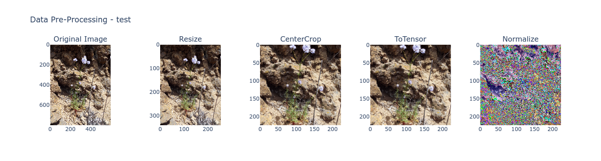


### CNN 1 - From Scratch


A first neural network was built/coded "from scratch". This model used the following architecture, which is a simplified version of VGG16. 

See class `NeuralNetworkScratch` and function `get_model_scratch` for exact architecture.

| Component         | Layers                    | Size          |
|-------------------|---------------------------|---------------|
| Input             | RGB Image                 | 224 x 224 x 3 |
| Feature Extractor | 2 conv layer + 1 max pool |               |
|                   | 2 conv layer + 1 max pool |               |
|                   | 2 conv layer + 1 max pool |               |
| Classifier        | Flatten layer + dropout   |               |
|                   | 1 fully connected + ReLU  |               |
|                   | 1 fully connected + ReLU  |               |
| Output            | Log Softmax               | 50            |


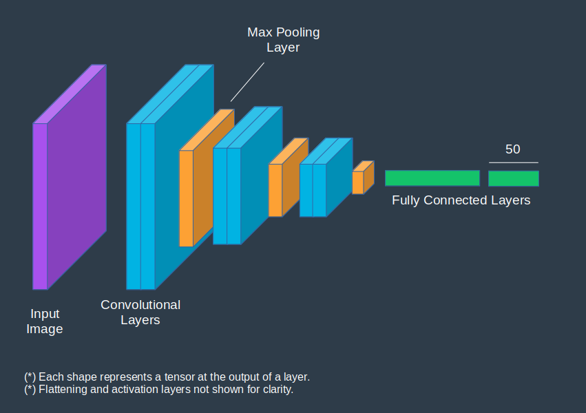


### CNN 2 - From Transfer Learning

The 2nd neural network uses a pre-trained version of the VGG16 neural network [6], with its classifier replaced by the same classifier as CNN 1 above.

As per reference [1], only the classifier weights are retrained since:

- the new dataset is small (~6000 images) while VGG16 was trained over 1.2 million images;
- the new dataset is similar to the dataset on which VGG16 was trained.

See function `get_model_transfer` for exact architecture.

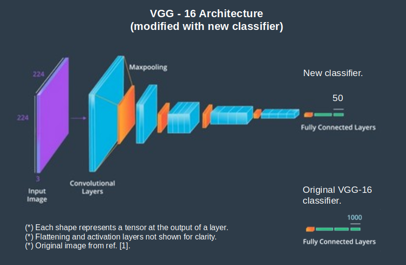


### Train

Both neural networks are trained using the following parameters.

| Parameter      | Method                       | Value / Function |
|----------------|------------------------------|------------------|
| Error function | Negative Log Loss Likelihood | nn.NLLLoss()     |
| Metrics        | Accuracy                     | > 60 %           |
| Batching       | Mini-batches                 | 64 data points   |
| Optimizer      | Stochastic Gradient Descent  | nn.optim.SGD()   |
| Epochs         | -                            | 50               |                     
| Learning rate  | -                            | 0.01             |

CNN 1 learning curves.

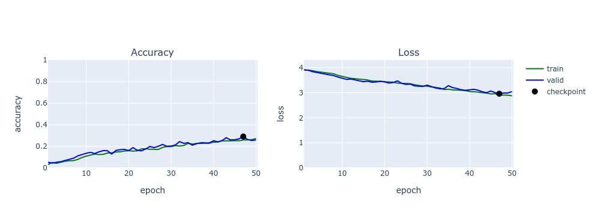

CNN 2 learning curves.

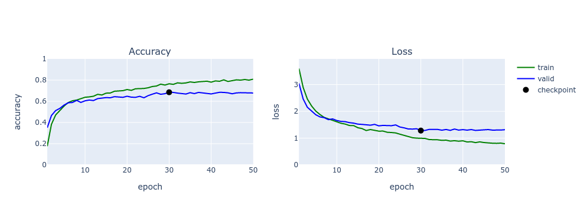


### Test

CNN 2 met the accuracy requirement and was selected as the best model. It was ran on the test dataset and the accuracy requirement was still met.

| Neural Network                 | Test accuracy    |
|--------------------------------|------------------|
| CNN 2 (from transfer learning) | 74 %            |


# IMPLEMENTATION

### landmark.py

The selected CNN (and its associated pipeline) was implemented in file `landmark.py` and can now be used to perform predictions on an image it has never seen before.

### Usage - Train the CNN

```
from landmark import *
import torch
import torch.optim as optim

# Directories of train-test data
dir_train = "data/landmark_images/train"
dir_test = "data/landmark_images/test"

# File containing image categories & indexes
file_categories = "categories.json"

# Model checkpoint & metrics file
file_checkpoint = "model_checkpoint.pt"
file_metrics = "model_metrics.json"

# Device for calculations (CPU/GPU)
device = "cuda" if torch.cuda.is_available else "cpu"

# Get DataLoaders
dls = get_data_loaders(dir_train, None, dir_test, 0.25)

# Instantiate CNN built from transfer learning
model = get_model_transfer()

# Train model

n_epochs = 50
criterion = nn.NLLLoss()
optimizer = optim.SGD(model.classifier.parameters(), lr=0.01)

for param in model.features.parameters():
    # Disable gradient calculations on features
    param.requires_grad = False

train(n_epochs, dls, model, optimizer, criterion, file_checkpoint, file_metrics, device)

# Plot training metrics
plot_metrics_file(file_metrics)

```


### Usage - Predict With the CNN

```
import json
from landmark import *
import torch

# File containing image categories & indexes
file_categories = "categories.json"

# Dummy file for predictions
file_testme = "testme.jpg"

# Device for calculations (CPU/GPU)
device = "cuda" if torch.cuda.is_available else "cpu"

# File containing image categories & indexes
with open(file_categories, "r") as f:
    d_categories = json.load(f)

# Load model checkpoint 
model = get_model_transfer()
model.load_state_dict(torch.load("model_checkpoint.pt"))

# Predict k most likely categories
plot_top_k_categories(model, file_testme, d_categories, 3, device)

```

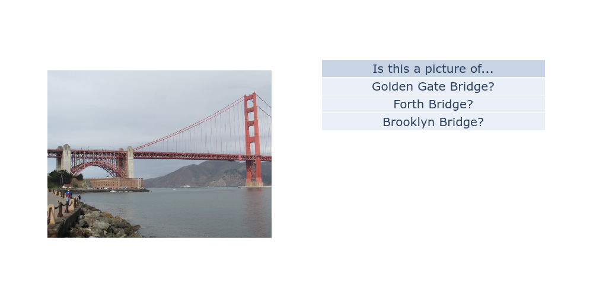 


# Appendix

### Accronyms

| Accronym | Description                                                   |
|----------|---------------------------------------------------------------|
| CNN      | Convolutional Neural Network                                  |
| VGG16    | Visual Geometry Group Neural Network - 16 Layer Configuration |

### References

[1] Udacity, Deep Learning Nanodegree, https://www.udacity.com/course/deep-learning-nanodegree--nd101

[2] Udacity, Landmark Classification Project, https://github.com/udacity/nd101-c2-landmarks-starter

[3] Udacity, Landmark Dataset, https://udacity-dlnfd.s3-us-west-1.amazonaws.com/datasets/landmark_images.zip

[4] Common Visual Data Foundation, Google Landmarks Dataset v2, https://github.com/cvdfoundation/google-landmark

[5] PyTorch, Models and Pre-Trained Weights, https://pytorch.org/vision/stable/models.html

[6] Geeks For Geeks, VGG-16 | CNN Model, https://www.geeksforgeeks.org/vgg-16-cnn-model/


